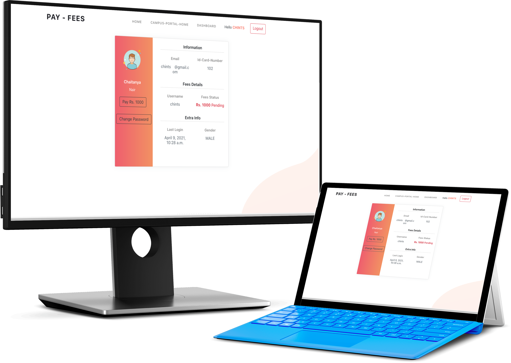
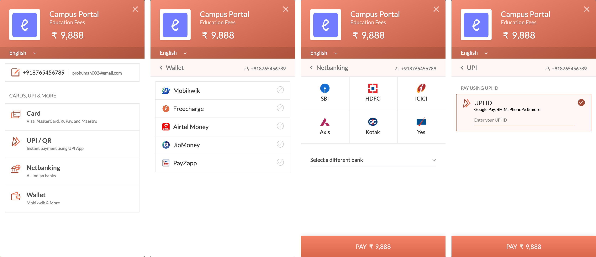

Push project to existing repositary without changing existing code with new branch

- git init

- git add .

- git commit -m '`your custom commit name`'

- git checkout -b `yourname/branch_name`

- git config --global user.email `your github emailid`

- git config --global user.name `your github username`

- git config --global --list
  > _CHECK USERNAME AND EMAIL_

- git remote set-url origin `url`

- git remote -v
  > _CHECK URL FETCHED_

- git branch
  > _CHECK BRANCH_

- git push --set-upstream origin `yourname/branch_name`
  
  
  
  -----
  -----
  
  #### CONFIGURATION in  razor/settings.py 
```
  DATABASES = {
    'default': {
    'ENGINE': 'django.db.backends.mysql',
    'NAME': 'student_pay',                   
    'USER': 'root',
    'PASSWORD': 'root',
    'HOST': '127.0.0.1',                    
    'PORT': '8889',
    # 'OPTIONS':{
    #     'init_command':'SET sql_mode = "STRICT_TRANS_TABLES"'
    # }               
  }
}
```


-----
-----
#### Screenshots and Images/UI of Project



----
----
##### Full Flex Responsiveness News Page also added to integrate with other connected project


----
----
----

#### Modes of Payment




